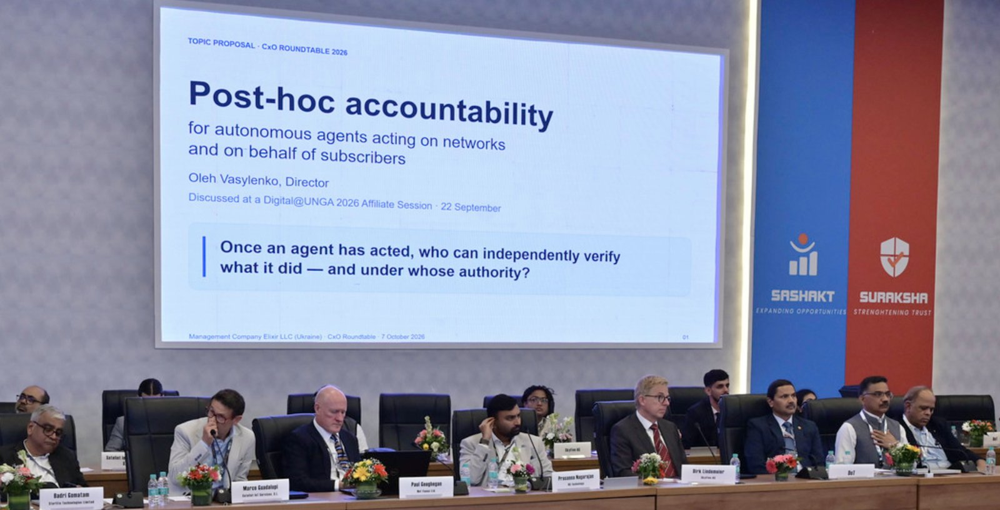
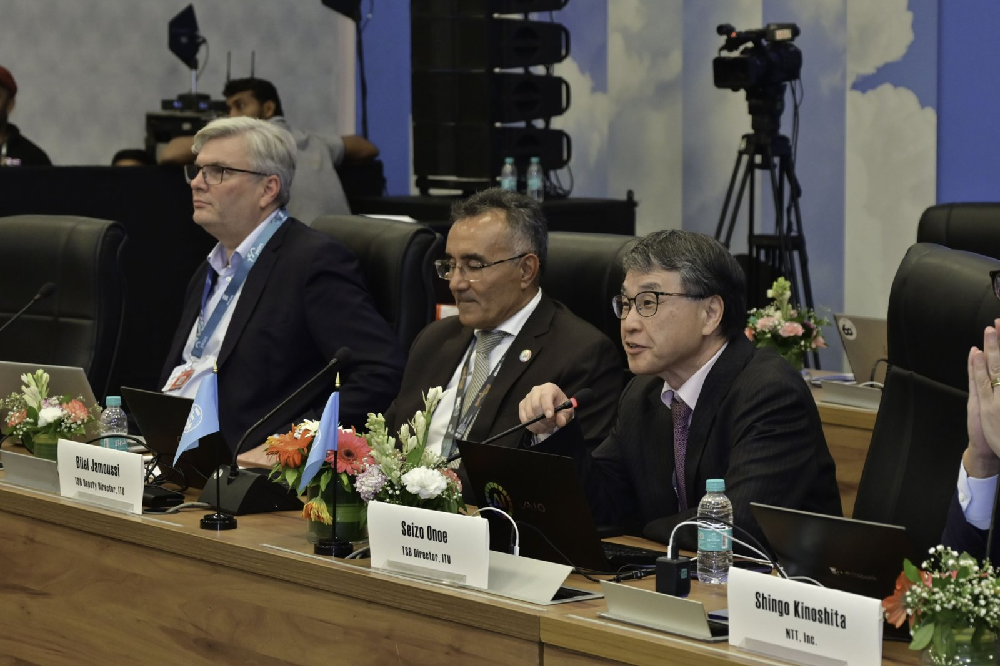

# ITU TSB Director's CxO Roundtable 2026

New Delhi, 7 October 2026, alongside India Mobile Congress 2026

- **Status:** Completed
- **Date:** 7 October 2026
- **Convened by:** Director of the ITU Telecommunication Standardization Bureau (TSB)
- **Participation:** Management Company Elixir LLC (Ukraine), ITU-T Associate, took part remotely
- **Official outcome:** [CxO Roundtable 2026 Communiqué](https://www.itu.int/en/ITU-T/tsbdir/cto/Documents/Communique_ITU_CxO_2026_updated.pdf) (PDF), published by ITU on the [ITU CxO homepage](https://www.itu.int/en/ITU-T/tsbdir/cto/Pages/default.aspx)

## Topic presented

**Post-hoc accountability for autonomous agents acting on networks and on behalf of subscribers**

Once an agent has acted, who can independently verify what it did, and under whose authority?

The topic was presented by Oleh Vasylenko, Director, Management Company Elixir LLC, in the session "Reliable and trusted infrastructure and identity for the AI era". It builds on the discussion at the [Digital@UNGA 2026 Affiliate Session](../2026-09-22-digital-unga) on 22 September 2026.

## What the Communiqué says

The Communiqué adopted at the Roundtable includes a section on trusted AI agents. Quoted verbatim:

> CxOs encouraged ITU to map existing work and coordinate standards development for already-executed actions of autonomous agents to be independently verified and linked to delegated authority across organizational and network domains.

The full text, including the list of participating organizations, is the official [ITU document](https://www.itu.int/en/ITU-T/tsbdir/cto/Documents/Communique_ITU_CxO_2026_updated.pdf). The quotation above is provided for convenience; the ITU document is authoritative.

## Photos

Photos: ITU, from the official [CxO Roundtable 2026 photo album](https://www.flickr.com/photos/itupictures/albums/72177720336058704). Shared with ITU's permission for participants' communications. The photos are not covered by this repository's CC BY 4.0 license.

## Note on status

This page is a personal record by Oleh Vasylenko / Management Company Elixir LLC. It is not an ITU publication and does not represent the position of ITU, ITU-T, TSB or any ITU body. The Roundtable discussion was held under the Chatham House Rule; this record therefore covers only the presentation given by Management Company Elixir LLC and the published Communiqué.
